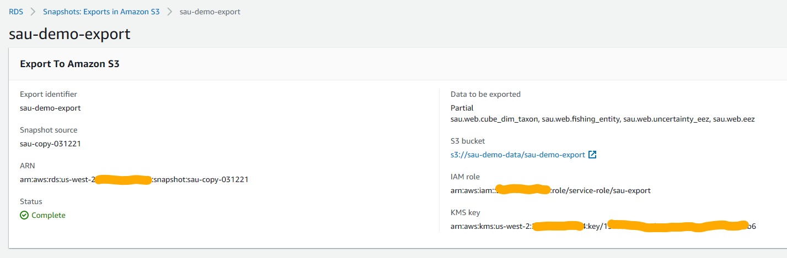

## Why?

Export only the tables you need from an RDS database instance to S3. Store the data in a compressed format
to be accessible for Glue crawlers and Athena queries.

## How to export RDS database instance to S3?

## Step 1: Export to S3 (Identifiers: only the tables needed)

## Step 2: Destination, IAM role, Encryption

## Step 3: Status (wait for completion). 

> Note: KMS key here is the same one to be used in Glue service role.

## Step 4: Output (verify the output in S3).

> Crawler can now be setup and data can be accessed via Athena queries.

