## Why?

We can use the data in S3 as a database with the help of crawlers. A crawler connects to a data store, determines the schema for your data, and then creates metadata tables in your data catalog. This allows GLUE and services such as ATHENA to view the S3 information as a database.

## How to setup a Glue Crawler?

## Step 1: Add crawler

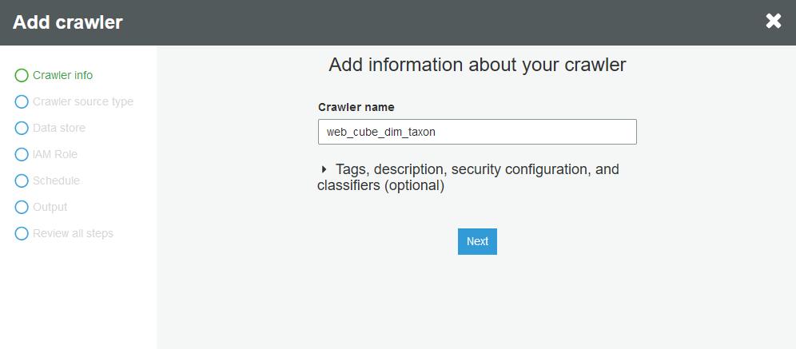

## Step 2: Specify crawler source type

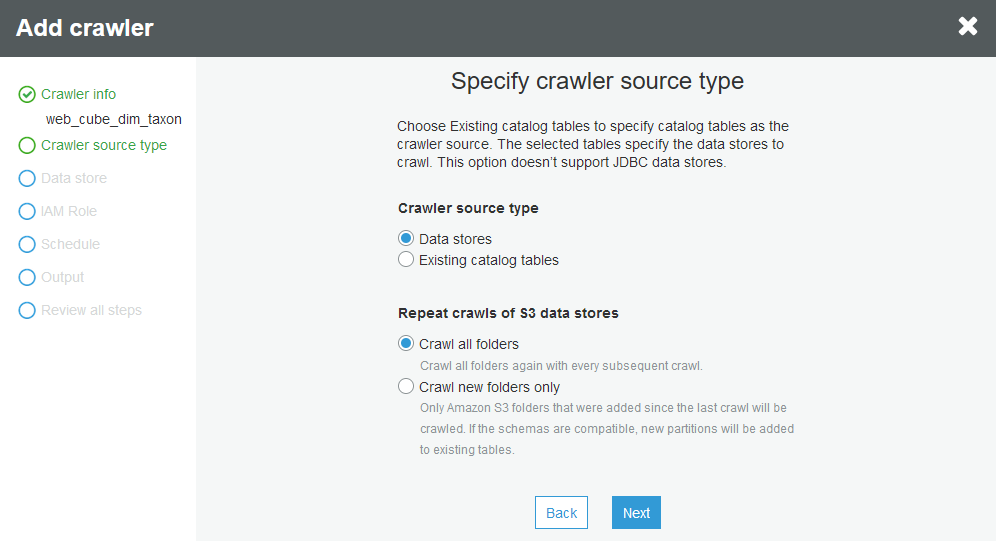

## Step 3: Add a data store

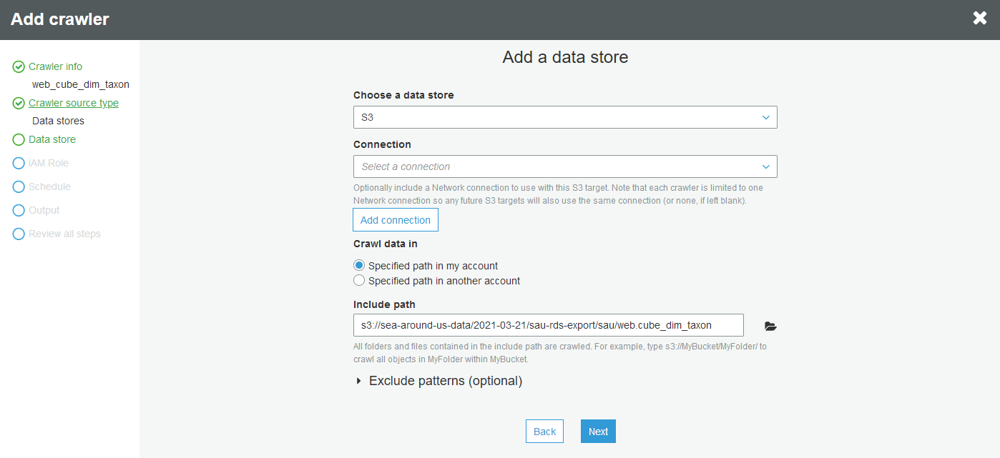

Note:     
• Include Path – point to the S3 folder path where the source data for this crawler is located.      
• Exclude Patterns – use this if there are files in S3 folder that you do not want to be part of the data.      
• Add another data store (if needed) in the next step.      

## Step 4: Choose an IAM role

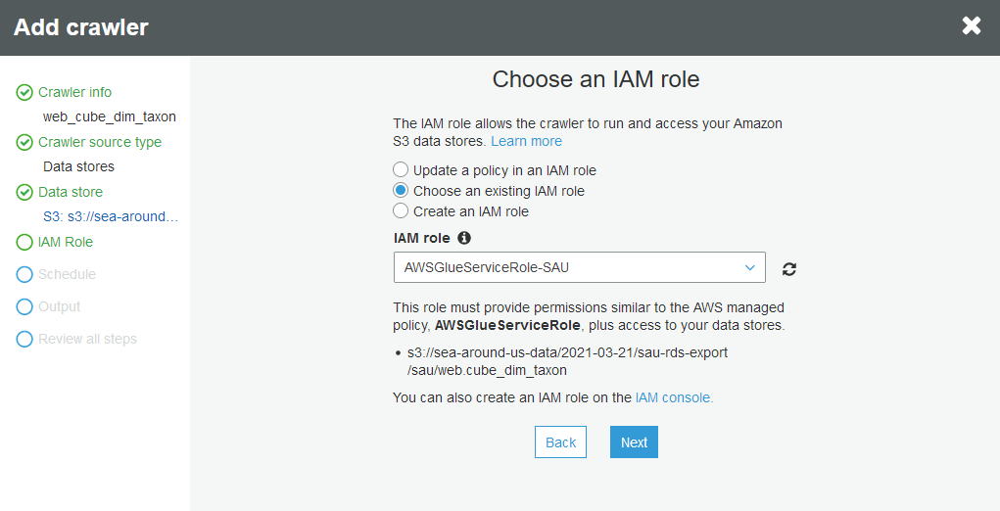

Note:     
• This role needs additional permission, refer to the Appendix at the end of this document for an example.

## Step 5: Create a schedule for this crawler

Change Frequency as needed.

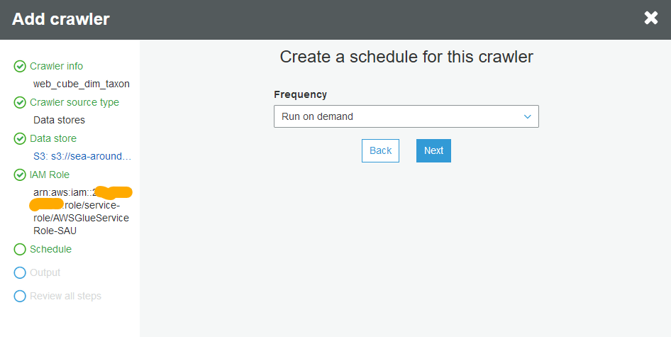

## Step 6: Configure the crawler’s output

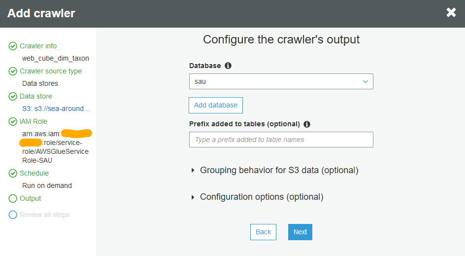

## Step 7: Review all steps

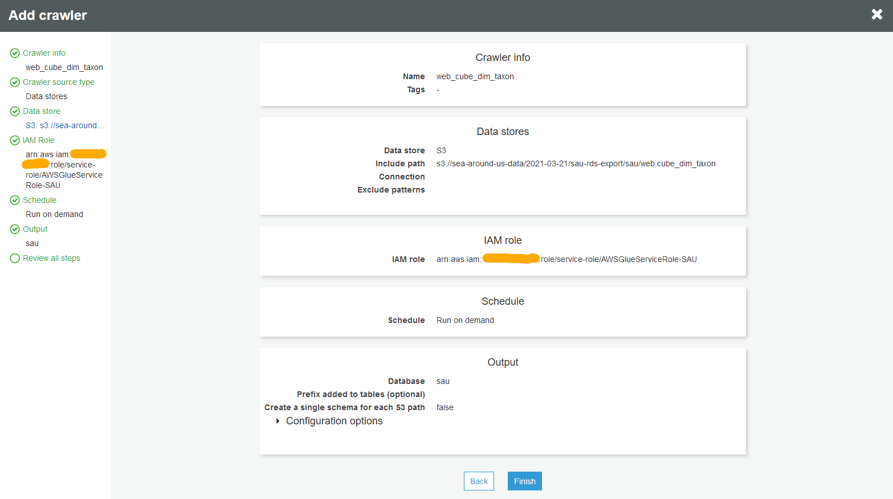

## Step 8: Manual run of crawler – “Run crawler”

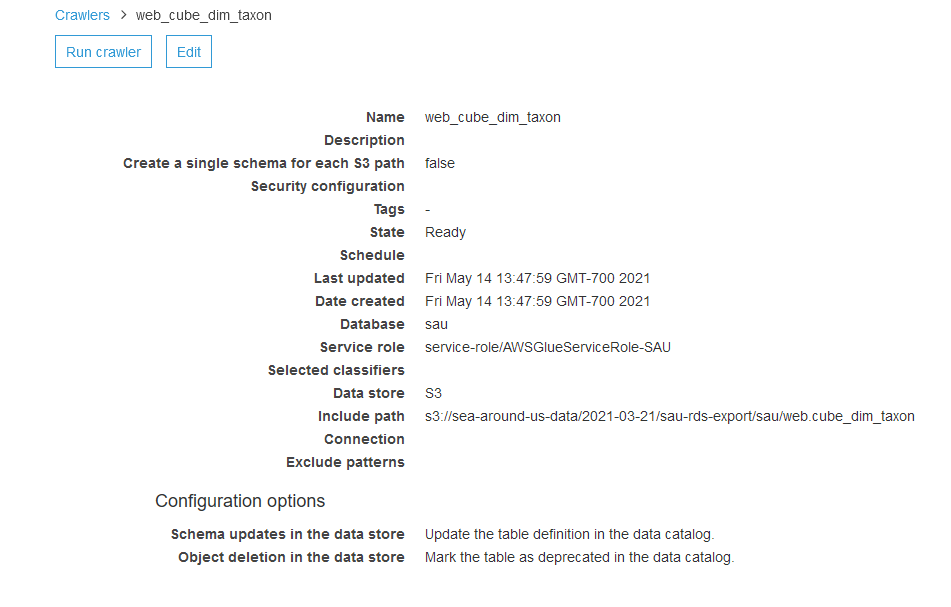

## Step 9: Review Output in Glue >> Databases >> Tables 

(Edit Schema if any data types look incorrect)

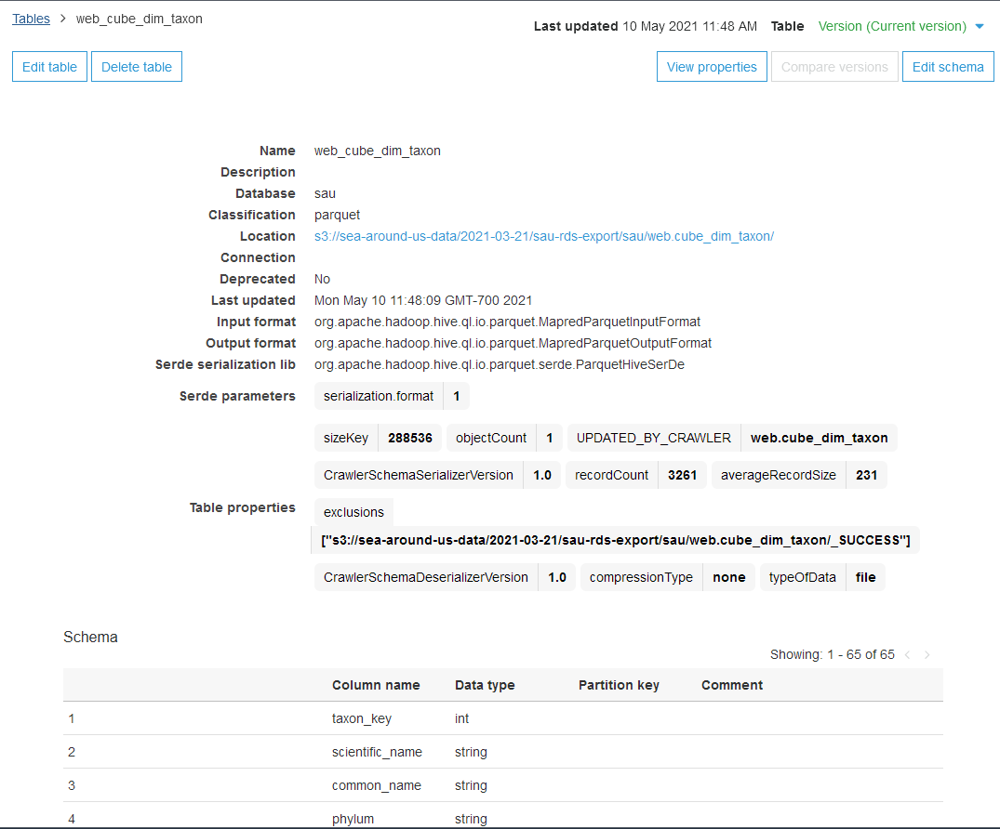

## Step 10: Athena results location setting

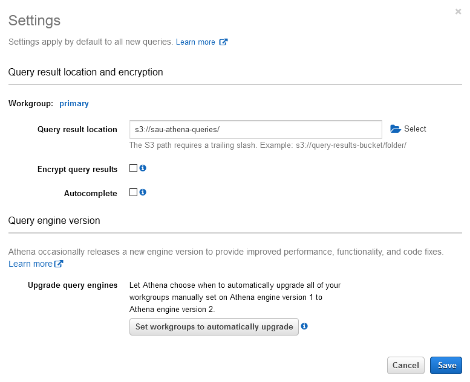

## Step 11: Query data using Athena

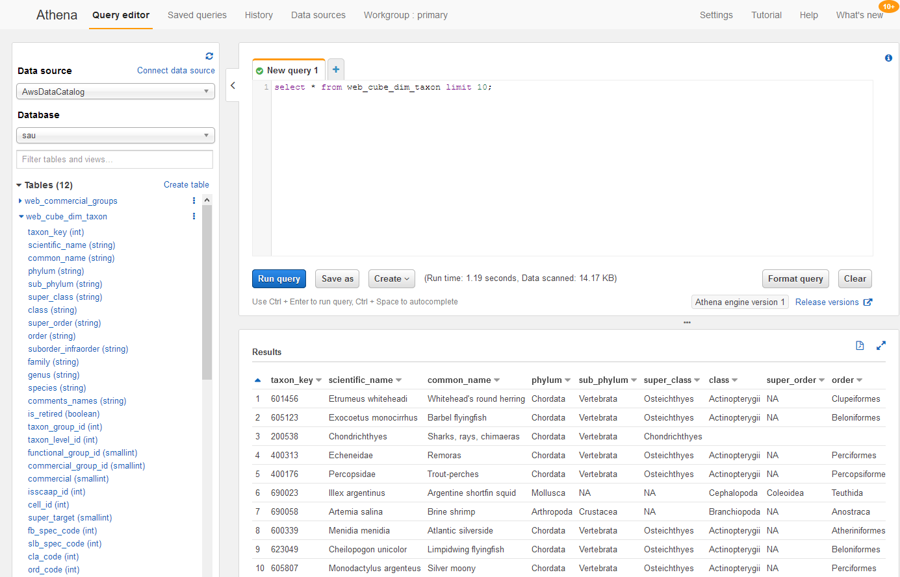

## __Appendix__

IAM role for Glue service     
• This IAM role should have permission decrypt using the KMS key used by the RDS export.      
• Screenshots below – IAM role summary and json examples.       

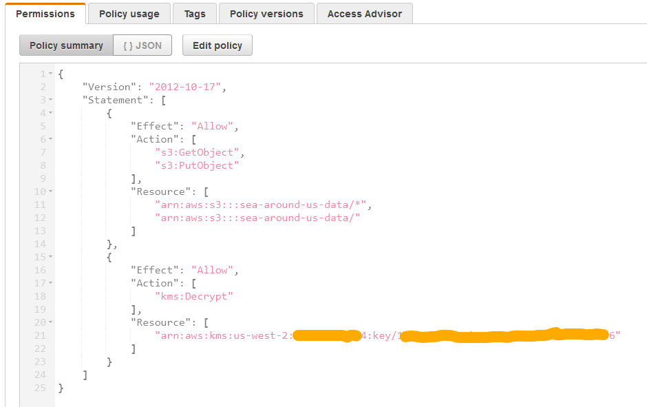

