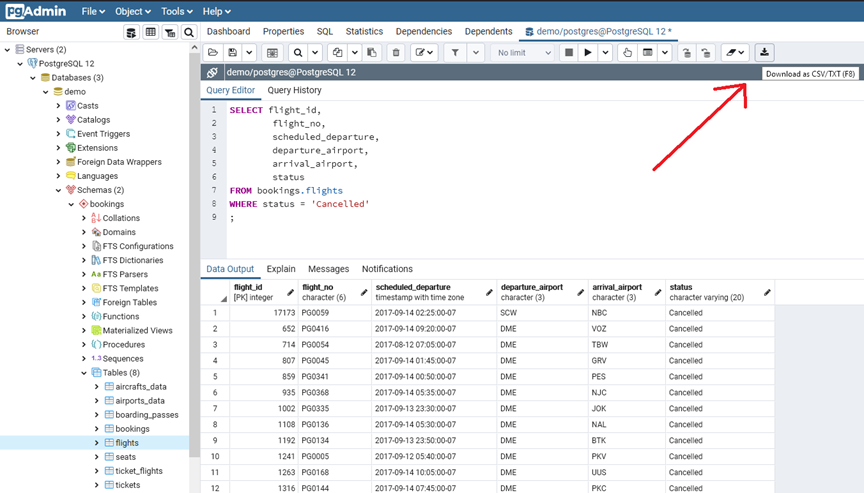
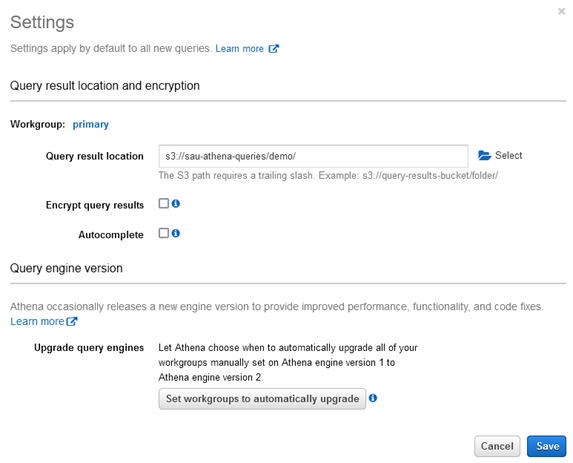
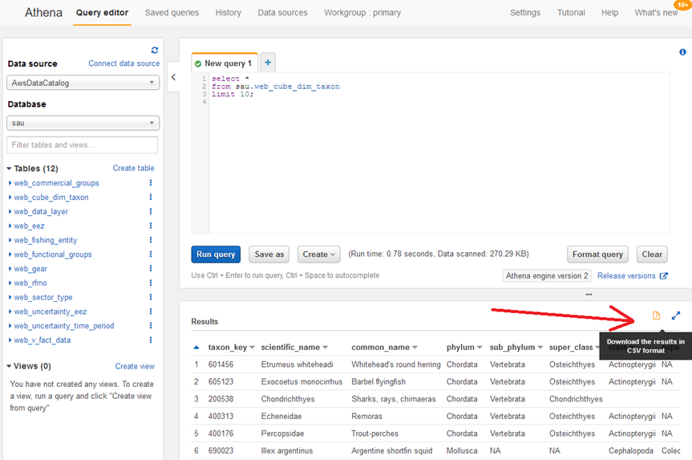
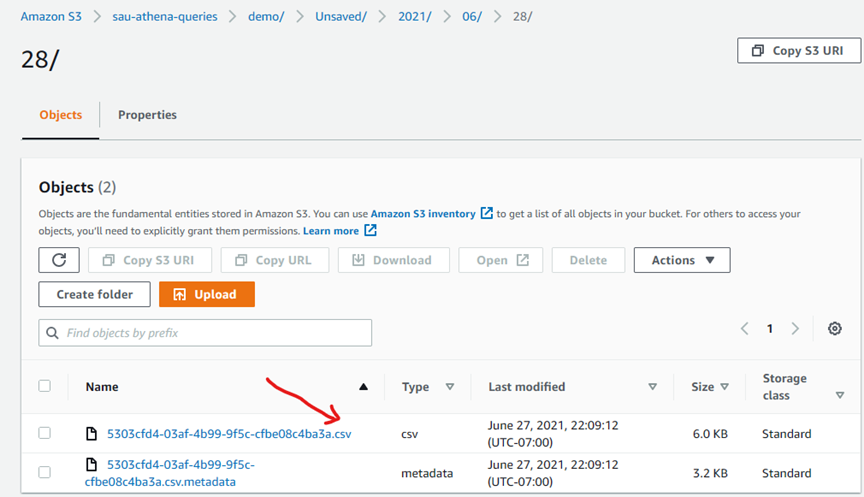

## Why?

RDS export to S3 creates files in an efficient and compressed parquet format. But sometimes, we need immediate access to the data for analysis in the form of a csv for example. Quick analysis can be done on directly on CSV data using spreadsheet programs like Excel, or by using other visualization tools, or using programming languages like Python.

## How?

CSV files of the data can be generated in multiple ways.     
• SQL results from your favorite database tools can be saved as CSV directly. An example screenshot for Postgres using pgAdmin is shown in below screenshot        
• In AWS, SQL query results from Athena can be exported to CSV if needed       
• Moreover, CSV is automatically generated when a query is executed in Athena and is stored in the S3 folder given in settings. This CSV file can be renamed or moved to another S3 folder for further analysis on the data. Athena and S3 screenshots provided below        

## Export SQL query results as CSV (from pgAdmin for Postgres database)

## CSV files using AWS Athena
First select S3 folder for storing query results

## Now the query result can be exported as CSV from Athena

## The better option is to just use the CSV that is automatically generated by Athena when the query is executed. This CSV can be renamed/moved to another S3 folder as needed for further analysis.

