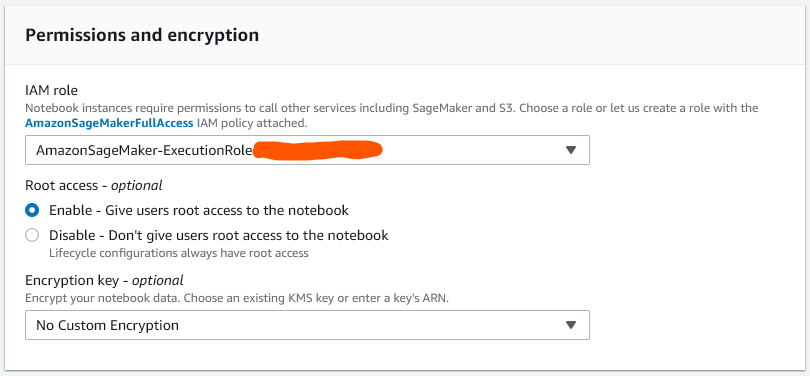

## Why?

An Amazon SageMaker notebook instance is a machine learning (ML) compute instance running the Jupyter Notebook App. SageMaker manages creating the instance and related resources. Jupyter notebooks in your notebook instance can be used to prepare and process data, to perform analysis, to create visualizations etc.

## How?

Create an instance of Amazon SageMaker notebook

Instructions for creating notebook instance     
• In the notebook instance settings, give the instance a name and select the type as needed (screenshot 1 below).      
• Optionally, a new lifecycle configuration can be created (or selected from the dropdown if existing). As defined in this setup, default scripts, libraries, and plugins will be pre-installed when the instance is being created.     
• Appropriate IAM role with necessary permissions must be selected (screenshot 2 below)          

In the Permissions and encryption section – select a IAM role that has AmazonSageMakerFullAccess IAM policy attached. This role also requires permissions to call other services like S3, Athena etc.

