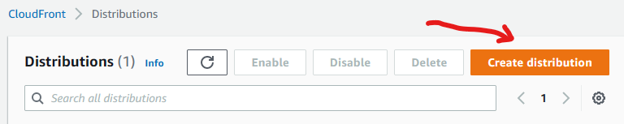
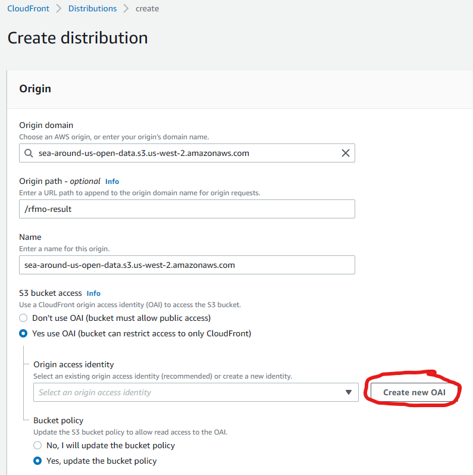

## Why?

Accessing the data in Jupyter notebooks through the files stored in S3 has several advantages - easy to setup and use, highly scalable and available from anywhere. However, setting up an Amazon CloudFront to work with your S3 bucket helps optimize the application's performance while effectively managing cost, and is highly recommended to serve and protect the content. 

CloudFront serves content through a worldwide network of data centers called Edge Locations. Using edge servers to cache and serve content improves performance by providing content closer to where viewers are located.

## How?

Create a CloudFront distribution

Instructions for creating the distribution     
• In the Origin settings, select the Origin domain or the S3 bucket (screenshot below).      
• Optionally, a subfolder within the bucket can be added in the Origin path as shown below.             

Origin Access

* Update and Review the S3 bucket __policy__ to provide access via CloudFront distribution. Further instructions can be found in below page      
* https://aws.amazon.com/premiumsupport/knowledge-center/cloudfront-access-to-amazon-s3/

Other common settings include        

* Viewer protocol policy : Redirect HTTP to HTTPS       
* Use all edge locations (best performance)       
* Standard logging : On (select the S3 bucket where CloudFront delivers log files)        

Refer to following for additional details about the process for creating a distribution.

* https://docs.aws.amazon.com/AmazonCloudFront/latest/DeveloperGuide/distribution-web-creating.html
* https://docs.aws.amazon.com/AmazonCloudFront/latest/DeveloperGuide/distribution-web-values-specify.html
